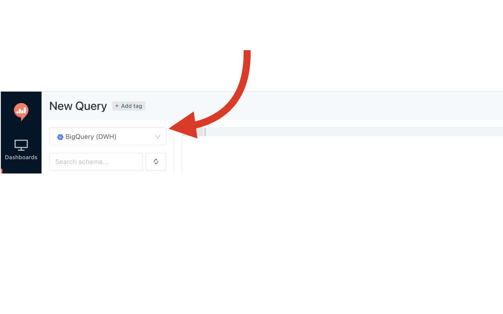

# redash-default-ds

redash-default-ds is a chrome extension to configure default datasource for Redash. You can set the default datasource on the options page.

Chrome Web Store: [Redash default datasource](https://chromewebstore.google.com/detail/redash-default-datasource/mjnfgaibkgfdbccahbbijcolacfojeom)

Using [icooon-mono.com](https://icooon-mono.com/10232-calculation/)
